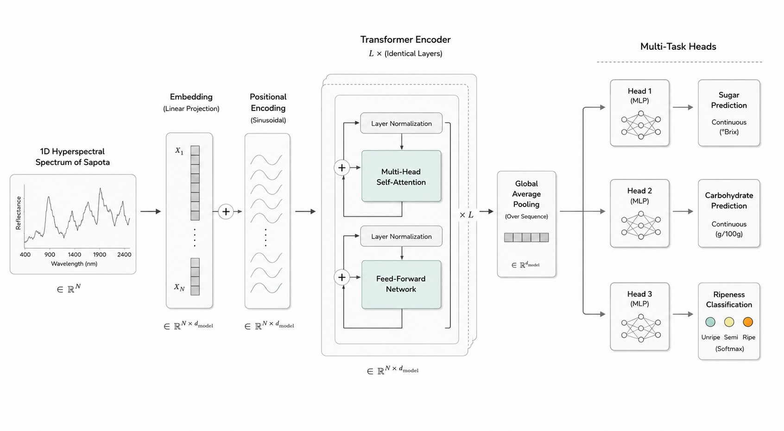
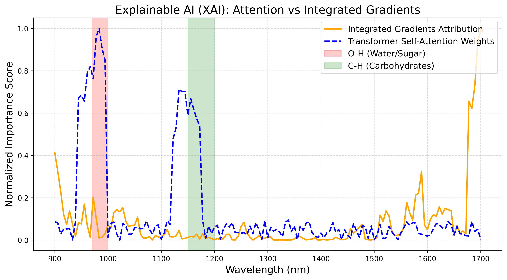

# Quantifying Sugar and Carbohydrate Levels in Sapota Using Hyperspectral Imaging and Multi-Task Spectral Transformers



This repository contains the official dataset, code, and manuscript for our research on the non-destructive evaluation of sapota fruit using hyperspectral imaging and deep learning.

## Overview
Fruits like Sapota (*Manilkara zapota*) exhibit negligible external color changes during ripening, making visual inspection insufficient. To predict their internal biochemical readiness non-destructively, we propose the **Multi-Task Spectral Transformer (MT-ST)**. 

By analyzing hyperspectral signatures (900-1700 nm), the MT-ST simultaneously predicts continuous sugar and carbohydrate levels while classifying the structural ripeness stage. The multi-task learning paradigm acts as a strict regularizer, enabling the deep Transformer architecture to learn from a constrained agricultural dataset (200 physical fruits, augmented to 416 effective samples per epoch) without severe overfitting.

The proposed MT-ST architecture consistently outperforms baseline machine-learning and transformer-based methods, achieving:
*   **Classification Accuracy:** 64.0%
*   **Sugar Regression:** $R^2 = 0.51$, RMSE = 3.79

## Repository Structure

The project has been organized for strict reproducibility:

```text
├── Dataset/             # Curated hyperspectral dataset and validated chemical metrics
├── Images/              # Core figures, charts, and visualizations generated from the model
├── Notebooks/           # PyTorch implementation (Jupyter Notebooks) for MT-ST training and XAI
└── Paper/               # The final compiled Springer LaTeX manuscript and bibliography
```

## Dataset
*   **Source:** 200 physical sapota samples procured from a controlled vendor in Nagpur, Maharashtra.
*   **Acquisition:** Resonon Pika-IR hyperspectral camera covering the eSWIR range (900-1700nm).
*   **Validation:** Destructive chemical analysis at the Laxmi Narayan Institute of Technology (LIT) to measure exact Sugar (% Brix) and Carbohydrates (g).

## Model Architecture
The **MT-ST** is designed specifically for 1D spectral data:
1.  **1D Convolutional Patch Tokenizer:** Compresses 145 contiguous spectral bands into 29 continuous macro-tokens to preserve local absorption shapes.
2.  **Transformer Encoder:** 4 layers with Multi-Head Self Attention (8 heads, 256 dim) autonomously isolating critical spectral bands without manual feature engineering.
3.  **Multi-Task Heads:** Concurrent prediction of continuous metrics and discrete ripeness stages.

### Explainable AI (XAI)
The self-attention mechanisms were mapped against **Integrated Gradients (IG)**. The network autonomously highlights the 970-1000 nm and 1150-1200 nm regions, which perfectly align with known physicochemical bond absorptions for O-H (water/sugar) and C-H (carbohydrates).



## Getting Started

1.  **Clone the repository:**
    ```bash
    git clone https://github.com/Devguru-codes/research_paper_chikoo.git
    cd research_paper_chikoo
    ```
2.  **Explore the Notebooks:**
    Navigate to the `Notebooks/` directory and run `initial_code.ipynb` or `phase_2_notebook.ipynb` to view the data loading, preprocessing (SNV + SG filters), model training, and evaluation pipelines.
3.  **Read the Paper:**
    The final manuscript can be found in `Paper/springer_manuscript.pdf`.

## Declarations
*   **Funding:** No funding was received for conducting this study.
*   **Conflict of Interest:** The authors declare that they have no conflict of interest.
